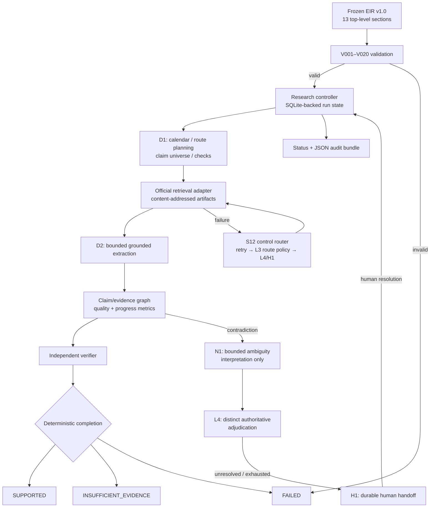

# EIR Domain 3 runtime

An offline-first, SQLite-backed implementation of the supplied EIR v1.0 Domain 3 research test. It does not contain or hard-code the 2025 FOMC answer.

```bash
python -m pip install -e ".[dev]"
pytest
eir-runtime validate fixtures/domain3.yaml
eir-runtime status fixtures/domain3.yaml --db state/fomc-live.sqlite --run-id fomc-2025
```

Default tests use synthetic schedule and statement fixtures only. Live retrieval is deliberately opt-in.

## Architecture



For an official-only run:

```bash
eir-runtime live fixtures/domain3.yaml --db state/fomc-live.sqlite --run-id fomc-2025
```

The runtime stores immutable content-addressed source artifacts, the source registry, action history, failure fingerprints, uncertainty records, and claim/evidence links in the SQLite database. Reusing a nonterminal run ID reconciles recorded inflight work; it never infers completion from interruption.

The canonical EIR top-level schema remains frozen at 13 sections. Claims, sources, citations, and hypotheses are runtime records held in the EIR `state`/`evidence` sections, not EIR primitives.
